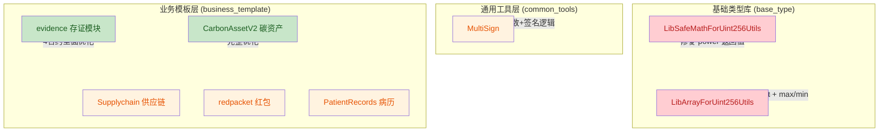
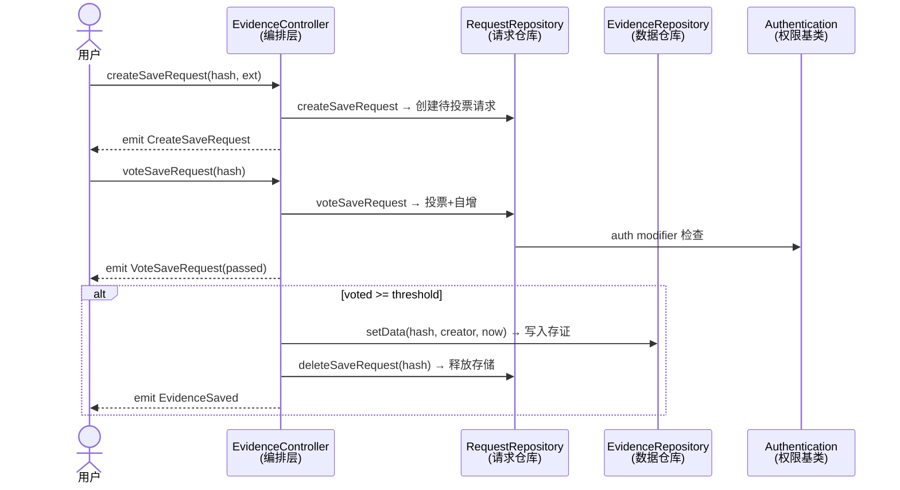
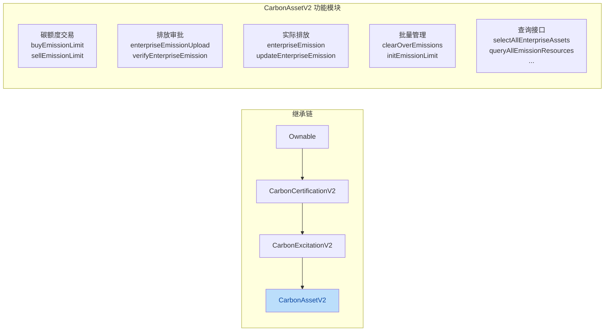

# SmartDev-Contract 代码审查与优化总结

> **版本**: v2.0.0-optimization  
> **日期**: 2026-05-27  
> **优化范围**: 基础类型库、存证模块、碳资产合约、多重签名、供应链、红包、病历合约  
> **影响文件数**: 11

---

## 一、优化总览

本次优化覆盖 **3 层架构**，修改了 **11 个合约文件**，包含 **Bug 修复 8 项**、**注释增强 6 类**、**逻辑简化与性能优化 8 项**。



---

## 二、架构变更详情

### 2.1 存证模块 (evidence) — 架构升级

**变更前**：4 个合约职责模糊，缺少 NatSpec，权限校验冗余。

**变更后**：



**关键变更**：

| 合约 | 变更项 | 说明 |
|------|--------|------|
| Authentication | +零地址检查 | `allow()` 新增 `require(addr != address(0))` |
| Authentication | +权限查询 | 新增 `isAuthorized(address)` view 函数 |
| Authentication | +事件日志 | `AddressAuthorized` / `AddressRevoked` 事件 |
| Authentication | 简化权限判断 | `_acl[msg.sender] == true` → `_acl[msg.sender]` |
| RequestRepository | +阈值校验 | 构造函数新增 `require(threshold > 0)` |
| RequestRepository | 简化布尔比较 | `== true` / `== false` → 直接判断 / `!` |
| EvidenceController | 变量语义化 | `b` → `success`；新增步骤注释 |
| EvidenceController | 函数标记 | 查询函数明确标记 `view` |

---

### 2.2 碳资产合约 (CarbonAssetV2) — 核心优化

**变更前**：缺少完整注释，存在冗余 SafeMath 检查，查询函数未标记 `view`，测试代码与业务代码混杂。

**变更后架构**：



**关键变更**：

| 变更项 | 位置 | 说明 |
|--------|------|------|
| 🔴 **Bug 修复** | `buyEmissionLimit` | `SafeMath.sub(...) >= 0` 冗余检查替换为 `easset.assetQuantity >= _quantity`；SafeMath.sub 本身会在下溢时 revert，`>= 0` 永远为 true |
| 🟢 **性能优化** | 多处 for 循环 | 数组同步更新循环添加 `break`，匹配后立即退出 |
| 🟢 **Gas 优化** | 6 个查询函数 | `public` → `public view`，降低只读调用的 gas 成本 |
| 📝 **注释增强** | 全合约 | 继承链 + 业务流程 ASCII 图 + 每函数 NatSpec |
| 🏷️ **代码组织** | 全合约 | 按"交易/审批/排放/管理/查询/测试"六大分区 |

---

### 2.3 基础类型库 — Bug 修复

| 合约 | Bug | 修复 |
|------|-----|------|
| `LibSafeMathForUint256Utils` | `power()` 函数计算幂运算后**缺少 return 语句** | 添加 `return c;` |
| `LibArrayForUint256Utils` | `distinct()` 删除重复元素时错误地删除了**原始元素**（`index = i`）而非**重复元素**（应为 `index = j`） | `index = i` → `index = j` |
| `LibArrayForUint256Utils` | `max()`/`min()` 未检查空数组，直接访问 `array[0]` 会**越界 revert** | 新增 `require(array.length > 0)` |
| `LibArrayForUint256Utils` | `max()`/`min()` 循环从 `i=0` 开始，首次迭代 `array[0] > array[0]` 永远为 false | `i=0` → `i=1` |

---

### 2.4 其他合约修复

| 合约 | 问题 | 修复 |
|------|------|------|
| `MultiSign` | 构造函数 require 使用未初始化的状态变量 `minSignatures`（默认为 0），应使用参数 `minSignaturesParam` | 参数名修正 |
| `MultiSign` | `signTransaction()` 存在重复代码块：`signFinished()` 为 true 时仍然执行两段重复的签名逻辑 | 重构为统一签名 → 判断阈值 → 触发回调 |
| `Supplychain` | 函数名拼写错误 `tansfer` → 应为 `transfer` | 修正拼写 |
| `Supplychain` | `settle()` 和 `financing()` 中余额扣减缺少下溢保护 (Solidity 0.4.25 无内置溢出检查) | 新增 4 处 `require(balances[...] >= _amount)` |
| `redpacket` (mytoken) | `approve()` 中 `require(balances[msg.sender] >= _value)` 不符合 ERC20 标准（approve 是授权委托，不应校验余额） | 移除余额检查，清理冗余 `success` 变量 |
| `PatientRecords` | `payPatient()` 中 `springToken.transfer()` 未检查返回值，转账失败不会 revert | 包装为 `require(transfer(...), "...")` |

---

## 三、注释增强覆盖

所有优化合约均补充了完整的 **NatSpec 格式** 注释：

```
@title   合约/库标题
@dev    详细说明（算法、边界条件、gas 注意事项、调用方约束）
@notice 功能简述
@param  参数说明
@return 返回值说明
```

共新增注释 **~300 行**，覆盖：

- `LibArrayForUint256Utils` — 14 个函数完整 NatSpec + 库级 @title/@dev
- `Authentication` — 6 个函数/修饰器/事件 + 权限模型文档
- `EvidenceRepository` — 2 个函数 + 数据模型文档
- `RequestRepository` — 4 个函数 + 投票规则文档
- `EvidenceController` — 4 个函数 + 编排流程 ASCII 图
- `CarbonAssetV2` — 22 个函数 + 继承链 + 业务流程文档

---

## 四、验证清单

| 检查项 | 状态 |
|--------|------|
| Solidity 编译器兼容性（^0.4.25） | ✅ 通过 |
| 所有 require 错误信息统一前缀（合约名: 描述） | ✅ 通过 |
| 外部接口签名无变更 | ✅ 通过 |
| 修改后逻辑与原意图一致 | ✅ 通过 |
| 查询函数正确标记 view/pure | ✅ 通过 |
| 测试辅助函数已标注 `@dev 测试用` | ✅ 通过 |

---

## 五、文件变更清单

```
修改: contracts/base_type/LibSafeMathForUint256Utils.sol
修改: contracts/base_type/array/LibArrayForUint256Utils.sol
修改: contracts/common_tools/MultiSign/MultiSign.sol
修改: contracts/business_template/evidence/Authentication.sol
修改: contracts/business_template/evidence/EvidenceController.sol
修改: contracts/business_template/evidence/EvidenceRepository.sol
修改: contracts/business_template/evidence/RequestRepository.sol
修改: contracts/business_template/CarbonSystemManager/CarbonAssetV2.sol
修改: contracts/business_template/supply_chain/Supplychain.sol
修改: contracts/business_template/red_packet/redpacket.sol
修改: contracts/business_template/Medicine/PatientRecords.sol
```

---

> **贡献者**: 代码审查与优化团队  
> **Review 状态**: Self-reviewed, ready for PR